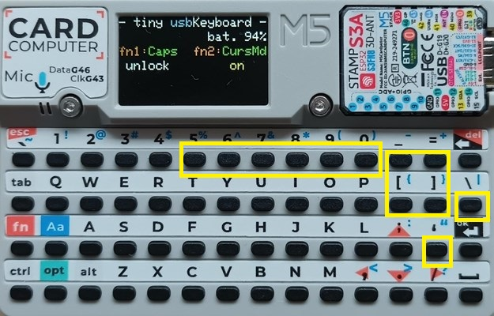
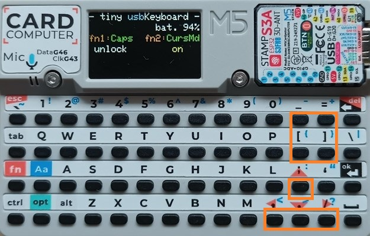

# tiny-usbKeyboard-Cardputer
**[` 日本語 `](README_jp.md)**

# USB Keyboard for Cardputer Manual

## 0. Change History

*   v104 2025-06-10
    *   Initial release

---

## 1. Introduction

This software (`tiny-usbKeyboard`) allows you to use the M5Stack Cardputer as a USB keyboard. All functions printed on the keyboard are implemented. Additionally, other useful keys are also implemented. Therefore, you can use the Cardputer as an almost standard small USB keyboard.

**Main Features:**
*   Standard key input, sending modifier keys (Shift, Ctrl, Alt, Opt)
*   Special functions through combination with the Fn key
    *   Toggle CapsLock (Fn + 1)
    *   Toggle Cursor Movement Mode (Fn + 2)
*   Power saving function
    *   Screen brightness reduction after a period of inactivity
*   Status confirmation via screen display

Utilizing the **Cursor Movement Mode** makes cursor movement and text editing easier. 
For example, by holding down the Shift key while moving the cursor, you can select characters or lines, and then operations like cut, copy, and paste (Ctrl-x/Ctrl-c/Ctrl-v) can be performed just like with a standard keyboard.

## 2. Startup and Screen Display

### 2.1. Connection and Startup
With the Cardputer powered off, connect it to a host device (PC, smartphone) via a USB cable. The Cardputer will automatically power on, and the software will start. You can immediately use it as a keyboard for the host device.

### 2.2. Screen Display Layout
The screen consists of 6 lines and displays the following information:

*   **L0 (1st line): Title**
    *   e.g., `- tiny usbKeyboard -`
*   **L1 (2nd line): Battery Level**
    *   e.g., `            bat. 76%`
*   **L2 (3rd line): Fn Key Function Guide**
    *   e.g., `fn1:Caps fn2:CursMd`
*   **L3 (4th line): Current Status of Fn Key Functions**
    *   CapsLock status (e.g., `unlock` / `lock`)
    *   Cursor Movement Mode status (e.g., `off` / `on`)
*   **L4 (5th line): Modifier Key Status / Power Saving Warning**
    *   Pressed modifier keys (e.g., `Shift Ctrl Alt Opt Fn`)
*   **L5 (6th line): Sent Key Information**
    *   Input character and HID code (e.g., when `a` is pressed, `a :hid 0x04`)
    *   Only HID code when a special key is sent (e.g., when `ENTER` is pressed, `hid 0x28`)

## 3. About Host Device Keyboard Driver
Characters input from the Cardputer keyboard are sent to the host device (PC, smartphone, etc.).
On the host device, please use an `English layout keyboard driver`.

If you use a `Japanese keyboard driver`, differences will occur for some characters.
Please refer to "9. Links: Using an English Keyboard with a Japanese Driver" for necessary adjustments.

## 4. How to Use

### 4.1. Basic Key Input
When a key on the Cardputer is pressed, the corresponding character or HID code is sent via USB.

### 4.2. Modifier Keys
-   `Ctrl`, `Shift`, `Alt`, `Opt` keys function as modifier keys when pressed simultaneously with other keys.
-   The `Fn` key is used for special functions and navigation key input.

### 4.3. Combinations with Fn Key

-   By pressing the `Fn` key along with the following keys, specific HID codes are sent.
-   Some of the keys have orange printing on the upper of them, and some are newly assigned keys.

| Fn + Key  | Function         | HID Code       |
| :-------- | :--------------- | :------------- |
| `Fn` + `` ` ``   | ESC              | `0x29`         |
| `Fn` + `BACK` | DELETE           | `0x4C`         |
| `Fn` + `5`    | F5               | `0x3E`         |
| `Fn` + `6`    | F6               | `0x3F`         |
| `Fn` + `7`    | F7               | `0x40`         |
| `Fn` + `8`    | F8               | `0x41`         |
| `Fn` + `9`    | F9               | `0x42`         |
| `Fn` + `0`    | F10              | `0x43`         |
| `Fn` + `\`    | Insert           | `0x49`         |
| `Fn` + `'`    | Print Screen     | `0x46`         |
| `Fn` + `;`    | ↑ (Up Arrow)     | `0x52`         |
| `Fn` + `.`    | ↓ (Down Arrow)   | `0x51`         |
| `Fn` + `,`    | ← (Left Arrow)   | `0x50`         |
| `Fn` + `/`    | → (Right Arrow)  | `0x4F`         |
| `Fn` + `-`    | Home             | `0x4A`         |
| `Fn` + `[`    | End              | `0x4D`         |
| `Fn` + `=`    | Page Up          | `0x4B`         |
| `Fn` + `]`    | Page Down        | `0x4E`         |

 
*Newly assigned keys (`fn` + KEY)

### 4.4. Caps Lock
-   Press `Fn` + `1` to toggle the Caps Lock state.
-   The screen L3 will display `lock` (enabled) or `unlock` (disabled).

### 4.5. Cursor Movement Mode
-   Press `Fn` + `2` to toggle the Cursor Movement Mode state.
-   When this mode is enabled (`on`), the following keys function as navigation keys without needing to press the `Fn` key:
    -   `;` -> ↑ (Up Arrow)
    -   `.` -> ↓ (Down Arrow)
    -   `,` -> ← (Left Arrow)
    -   `/` -> → (Right Arrow)
    -   `-` -> Home
    -   `[` -> End
    -   `=` -> Page Up
    -   `]` -> Page Down
-   The screen L3 will display `on` (enabled) or `off` (disabled).

 
*Key assignments in Cursor Movement Mode

## 5. Building and Flashing Firmware

There are two methods for flashing the firmware:

### 5.1. M5Burner
Using the `M5Burner` software, you can flash the firmware from your PC using online data.
Install and launch the `M5Burner` software. Select `CARDPUTER` as the device on the left side of the screen, choose `tiny-usbKeyboard`, and then follow the instructions to flash the firmware.

### 5.2. vsCode + PlatformIO
1.  Set up a development environment with vsCode + PlatformIO on your PC.
2.  Obtain this software from Github and build it.
3.  Connect the Cardputer to your PC and flash the firmware.

Please note that the Cardputer may need to be put into **firmware writing mode** by "pressing and holding the `BtnG0` button while connecting the USB cable, and then releasing the `BtnG0` button".

## 6. Power Saving Feature

### Brightness Reduction
Approximately 3 minutes after the last key input, the screen brightness will decrease. Pressing any key will restore normal brightness.

## 7. Switching Applications

You can switch between multiple BIN file applications on an SD card using a Launcher software for Cardputer.
The BIN file for this software can be obtained from the BINS folder on GitHub. Operation has been confirmed with the following two types of Launcher software.

### 7.1. M5Stack-SD-Updater

1.  **Preparation**:
    *   Install an M5Stack-SD-Updater compatible software (e.g., this software) onto the Cardputer by compiling it with M5Burner or vsCode beforehand.
    *   Prepare the files from the BINS folder (e.g., `menu.bin` and the application `usbKeyboard.bin`).
    *   Copy the BIN files to the root directory of the microSD card.
2.  **Application Switching Procedure**:
    *   With the Cardputer powered off, insert the microSD card.
    *   Turn on the Cardputer while pressing the 'a' key.
    *   `menu.bin` (M5Stack-SD-Updater menu screen) on the SD card will launch. Follow the on-screen instructions to select the file.
    *   The new application will be loaded, and the Cardputer will automatically restart upon completion.

### 7.2. M5Launcher Cardputer
Confirmed with M5Launcher Cardputer v2.3.10.

1.  **Preparation**:
    *   Install the `M5Launcher` firmware onto the Cardputer using M5Burner beforehand.
    *   Prepare the BIN file (`usbKeyboard.bin`) from the BINS folder.
    *   Copy the BIN file to the microSD card.

2.  **Application Switching Procedure**:
    *   With the Cardputer powered off, insert the microSD card.
    *   Once M5Launcher starts, press the return key immediately, then select SD on the screen and choose the BIN file for the application.
    *   Select Install. The new application will be installed, and the Cardputer will automatically restart upon completion.

## 8. Others

### If USB Connection Fails
If the USB connection with the host device is unsuccessful, try pressing the reset button to restart.

### Bluetooth Version Software Introduction
There is also a Bluetooth version, `tiny-bleKeyboard`, with the same key layout as this software. Both can be quickly switched and used with Launcher software, which is convenient.

*   [tiny-bleKeyboard-Cardputer: Bluetooth Keyboard Version](https://github.com/NoRi-230401/tiny-bleKeyboard-Cardputer)

## 9. Links

*   [tiny-usbKeyboard-Cardputer: GitHub for this software](https://github.com/NoRi-230401/tiny-usbKeyboard-Cardputer)

*   [M5 Cardputer as a USB Keyboard: by Shikarunochi-san](https://shikarunochi.matrix.jp/?p=5254)

*   [Swapping Programs on M5Cardputer Standalone: by Shikarunochi-san](https://shikarunochi.matrix.jp/?p=5268)

I gained a lot of knowledge about Cardputer from Shikarunochi-san's articles.

*   [Using an English Keyboard with a Japanese Driver: by MAST DESIGN-san](https://mastdesign.me/20240107-jiskeyboard-uskeyboard/)

*   [HID Key Codes: Onakasuita Wiki](https://wiki.onakasuita.org/pukiwiki/?HID%2F%E3%82%AD%E3%83%BC%E3%82%B3%E3%83%BC%E3%83%89)

*   [M5Stack-SD-Updater: by tobozo-san](https://github.com/tobozo/M5Stack-SD-Updater/)

