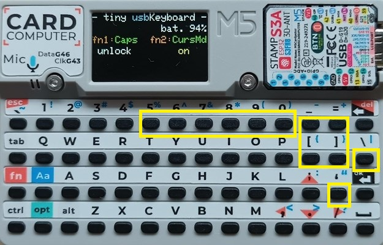
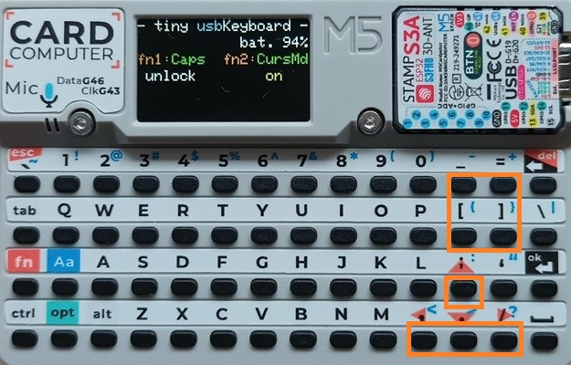

# tiny-usbKeyboard-Cardputer
**[`　English　`](README.md)**

# Cardputer用 USBキーボード 説明書

## 0. 変更履歴

*   v104 2025-06-10
    *   initial release

---

## 1. はじめに

このソフトウェア(`tiny-usbKeyboard`)は、M5Stack CardputerをUSBキーボードとして使用するためのものです。キーボード上に印刷されている全ての機能が実装されています。また、他の便利なキーも実装しています。そのため、Cardputerをほぼ標準の小さなUSBキーボードとして使用することができます。

**主な機能**：
*   標準的なキー入力、修飾キー（Shift, Ctrl, Alt, Opt）の送信
*   Fnキーとの組み合わせによる特殊機能
    *   CapsLockのオン/オフ (Fn + 1)
    *   カーソル移動モードのオン/オフ (Fn + 2)
*   省電力機能
    *   一定時間無操作で画面輝度低下
*   画面表示による状態確認

**カーソル移動モード**を活用するとカーソル移動や文章等の編集が楽になります。 
例えば、 シフトキーを押しながらカーソルを移動すれば文字や行の選択ができるようになり、その後は、切り取り・コピー・貼り付け（Ctrl-x/Ctrl-c/Ctrl-v）などが普通キーボードと同じ操作できるようになります。

## 2. 起動と画面表示

### 2.1. 接続と　起動
Cardputerの電源をOFF状態のまま、USBケーブルでホストデバイス（PC、スマートホン）と繋ぐと自動的に電源が入りソフトが起動します。すぐにホストデバイスのキーボードとして使用することができます。

### 2.2. 画面表示レイアウト
画面は6行で構成され、以下の情報が表示されます。

*   **L0 (1行目): タイトル**
    *   例: `- tiny usbKeyboard -`
*   **L1 (2行目): バッテリー残量**
    *   例: `            bat. 76%`
*   **L2 (3行目): Fnキー機能の案内**
    *   例: `fn1:Caps fn2:CursMd`
*   **L3 (4行目): Fnキー機能の現在の状態**
    *   CapsLockの状態 (例: `unlock` / `lock`)
    *   カーソル移動モードの状態 (例: `off` / `on`)
*   **L4 (5行目): 修飾キーの状態 / 省電力警告**
    *   押されている修飾キー (例: `Shift Ctrl Alt Opt Fn`)
*   **L5 (6行目): 送信キー情報**
    *   入力された文字とHIDコード (例: `a`押下時は、`a :hid 0x04`)
    *   特殊キー送信時はHIDコードのみ (例: `ENTER`押下時は、`hid 0x28`)

## 3. ホストデバイスのキーボード・ドライバについて
Cardputerのキーボードから入力した文字が、ホストデバイス(PC・スマホ等)に送信されます。
ホストデバイスでは、`英語配列用のキーボード・ドライバ`をご使用ください。

`日本語キーボード・ドライバ`を使用の場合は、一部のキャラクターで違いが発生します。
「9.Links:日本語ドライバで英語キーボードを使用」を参考にして対応が必要となります。

## 4. 操作方法

### 4.1. 基本的なキー入力
Cardputerのキーを押すと、対応する文字またはHIDコードがUSB経由で送信されます。

### 4.2. 修飾キー
-   `Ctrl`, `Shift`, `Alt`, `Opt` キーは、他のキーと同時に押すことで修飾キーとして機能します。
-   `Fn` キーは、特殊機能やナビゲーションキー入力に使用します。

### 4.3. Fnキーとの組み合わせ

-   `Fn`キーを押しながら以下のキーを押すことで、特定のHIDコードを送信します。
-   該当キーの上部にオレンジ色で印刷されているものと、新規に割当てたキーがあります。

| Fn + キー | 機能             | HIDコード      |
| :-------- | :--------------- | :------------- |
| `Fn` + `` ` ``   | ESC              | `0x29`         |
| `Fn` + `BACK` | DELETE           | `0x4C`         |
| `Fn` + `5`    | F5               | `0x3E`         |
| `Fn` + `6`    | F6               | `0x3F`         |
| `Fn` + `7`    | F7               | `0x40`         |
| `Fn` + `8`    | F8               | `0x41`         |
| `Fn` + `9`    | F9               | `0x42`         |
| `Fn` + `0`    | F10              | `0x43`         |
| `Fn` + `\`    | Insert           | `0x49`         |
| `Fn` + `'`    | Print Screen     | `0x46`         |
| `Fn` + `;`    | ↑ (上矢印)       | `0x52`         |
| `Fn` + `.`    | ↓ (下矢印)       | `0x51`         |
| `Fn` + `,`    | ← (左矢印)       | `0x50`         |
| `Fn` + `/`    | → (右矢印)       | `0x4F`         |
| `Fn` + `-`    | Home             | `0x4A`         |
| `Fn` + `[`    | End              | `0x4D`         |
| `Fn` + `=`    | Page Up          | `0x4B`         |
| `Fn` + `]`    | Page Down        | `0x4E`         |

 
＊新規割当キー（`fn` + KEY ）

### 4.4. Caps Lock
-   `Fn` + `1`  を押すと、Caps Lockの状態が切り替わります。
-   画面L3に `lock` (有効) または `unlock` (無効) と表示されます。

### 4.5. カーソル移動モード
-   `Fn` + `2`  を押すと、カーソル移動モードの状態が切り替わります。
-   このモードが有効 (`on`) の場合、`Fn`キーを押さなくても以下のキーがナビゲーションキーとして機能します。
    -   `;` -> ↑ (上矢印)
    -   `.` -> ↓ (下矢印)
    -   `,` -> ← (左矢印)
    -   `/` -> → (右矢印)
    -   `-` -> Home
    -   `[` -> End
    -   `=` -> Page Up
    -   `]` -> Page Down
-   画面L3に `on` (有効) または `off` (無効) と表示されます。

 
＊カーソル移動モード時の割当キー

## 5. ビルドとファームウエアの書き込み

ファームウエアの書込みには、次の２つの方法があります。

### 5.1. M5Burner
`M5Burner`ソフトを使うとPCからオンラインのデータでファームウエア書込みができます。
`M5Burner`ソフトをインストール、起動して画面の左側の機種には、`CARDPUTER`を指定し、`tiny-usbKeyboard` を選んでから指示に従いファームウエアの書込みをしてください。

### 5.2. vsCode + PlatformIO
1. PCに vsCode + PlatformIO の開発環境を用意します。
2. Github から本ソフトウエアを入手してビルドします。
3. CardputerをPCに接続し、ファームウエアを書き込みます。

Cardputerは、「`BtnG0`ボタンを押下しながら、USBケーブルを接続し、その後`BtnG0`ボタンを離す」操作で**ファームウエア書込みモード**にする必要がある場合があります。ご注意ください。

## 6. 省電力機能

### 輝度低下
最後のキー入力から約３分経過すると、画面の輝度が低下します。キー入力を行うと通常の輝度に戻ります。

## 7. アプリの切替え
Cardputer用のLauncherソフトを使用してSDカード上の複数のBINファイルのアプリを切替えて使用することができます。
本ソフトのBINファイルは、GitHubのBINSフォルダ下から取得してください。次の２種類のLauncherソフトで動作を確認しています。

### 7.1. M5Stack-SD-Updater

1.  **準備**:
    *   事前に、M5Stack-SD-Updater対応ソフト（例えば、本ソフト）をM5Burnerまたは、vsCodeにてコンパイルしてCardputerにインストールしてください。
    *   BINSフォルダ下のファイル (`menu.bin`とアプリ `usbKeyboard.bin`など) を用意します。
    *   microSDカードのルートディレクトリに、BINファイルをコピーします。
2.  **アプリ切替え手順**:
    *   Cardputerの電源がオフの状態で、microSDカードを挿入します。
    *   Cardputerの 'a' キーを押しながら電源を入れます。
    *   SD上の`menu.bin`（M5Stack-SD-Updaterのメニュー画面）が起動するので、画面の指示に従ってファイルを選択してください。
    *   新しいアプリがLoadingされ、完了すると自動的に再起動します。

### 7.2. M5Launcher Cardputer
M5Launcher Cardputer v2.3.10で確認しました。

1.  **準備**:
    *   事前にM5Burnerで、`M5Launcher`のファームウエアをCardputerにインストールしてください。
    *   BINSフォルダ下のBINファイル (`usbKeyboard.bin`) を用意します。
    *   microSDカードに、BINファイルをコピーします。

2.  **アプリ切替え手順**:
    *   Cardputerの電源がオフの状態で、microSDカードを挿入します。
    *   M5Launcherが起動したらすぐにリターンキーを押し、その後、画面でSDを選択してアプリ用のBINファイルを選択してください。
    *   Installを選択すると新しいアプリがインストールされ、完了すると自動的に再起動します。

## 8. その他

### 　USBの接続がうまくいかない場合
ホストデバイスとUSBの接続がうまくいかなかった場合には、リセット・ボタンを押して再起動してみてください。

### Bluetooth版ソフト紹介
本ソフトと同じキー配列で Bluetooth版 `tiny-bleKeyboard` のソフトもあります。どちらもLauncherソフトで素早く切替えて使用することができますので便利です。

・[tiny-bleKeyboard-Cardputer：Bluetooth版キーボード](https://github.com/NoRi-230401/tiny-bleKeyboard-Cardputer)

## 9. Links

・[tiny-usbKeyboard-Cardputer：このソフトのgithub](https://github.com/NoRi-230401/tiny-usbKeyboard-Cardputer)

・[M5 Cardputer を USB キーボードに：しかるのちさん](https://shikarunochi.matrix.jp/?p=5254)

・[M5Cardputer 単体でプログラムの入れ替え：しかるのちさん](https://shikarunochi.matrix.jp/?p=5268)

しかるのちさんの記事でたくさんのCardputerの知見を得ることができました。

・[日本語ドライバで英語キーボードを使用：MAST DESIGNさん](https://mastdesign.me/20240107-jiskeyboard-uskeyboard/)

・[HID Key Code：おなかすいたwiki](https://wiki.onakasuita.org/pukiwiki/?HID%2F%E3%82%AD%E3%83%BC%E3%82%B3%E3%83%BC%E3%83%89)

・[M5Stack-SD-Updater：tobozoさん](https://github.com/tobozo/M5Stack-SD-Updater/)

